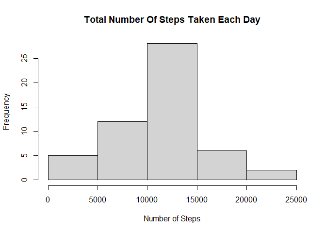
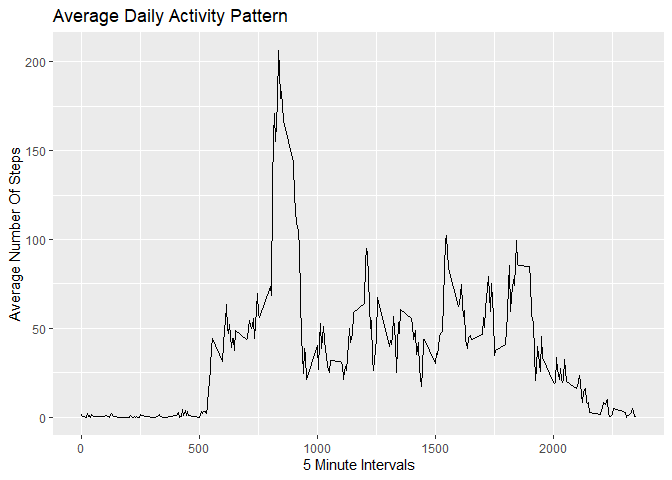
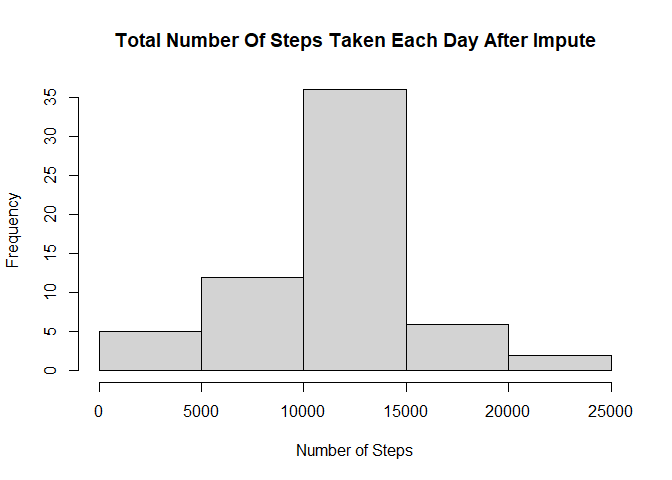
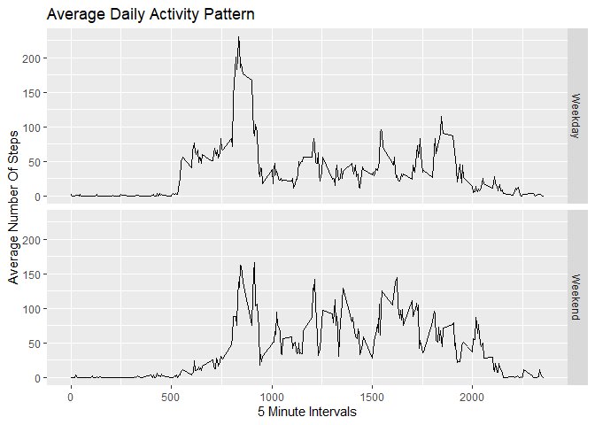

## Loading and preprocessing the data


```r
library(data.table)
library(ggplot2)

if(!file.exists("activity.zip")){
  
  zipurl <- "https://d396qusza40orc.cloudfront.net/repdata%2Fdata%2Factivity.zip"
  
  download.file(zipurl)
  
}

if (!file.exists("activity.csv")) { 
  
  unzip(zipfile="activity.zip")
  
}

database = read.csv('activity.csv')

str(database)
```

```
## 'data.frame':	17568 obs. of  3 variables:
##  $ steps   : int  NA NA NA NA NA NA NA NA NA NA ...
##  $ date    : chr  "2012-10-01" "2012-10-01" "2012-10-01" "2012-10-01" ...
##  $ interval: int  0 5 10 15 20 25 30 35 40 45 ...
```


## What is mean total number of steps taken per day?


```r
plotdata1 <- aggregate(steps~date,database,sum)

hist(plotdata1$steps, main = "Total Number Of Steps Taken Each Day", 
     xlab = "Number of Steps")
```

<!-- -->

```r
MeanSteps1 <- mean(plotdata1$steps, na.rm = TRUE)

MedianSteps1 <- median(plotdata1$steps,na.rm = TRUE)
```

**Mean Total Number Of Steps Taken Per Day** = 1.0766189\times 10^{4}

**Median Total Number Of Steps Taken Per Day** = 10765


## What is the average daily activity pattern? 


```r
plotdata2 <- aggregate(steps~interval,database,mean)


ggplot(data = plotdata2, aes(x = interval, y = steps))+
    geom_line()+
    ggtitle('Average Daily Activity Pattern')+
    xlab('5 Minute Intervals')+
    ylab('Average Number Of Steps')
```

<!-- -->

```r
MaxInterval <- plotdata2[which.max(plotdata2$steps),1]
```

**5-Minute Interval With Maximum Number Of Average Steps** = 835


## Imputing missing values

**Using the average daily patterns computed earlier to replace NA values with average number of steps from similiar intervals**


```r
## Create a vector of row indices with NA ##

NA_Rows <- which(is.na(database$steps))

## Loop over row indices with NA and replace them with average daily values from a similiar interval. ##

for(i in NA_Rows){
        
    tempfill <- plotdata2[which(grepl(database[i,3], plotdata2$interval))[1],2]
        
    database[i,1] <- tempfill
}

## End of impute, proceed with further calculations of the histogram with total number of steps per day and mean and median of the total number of steps per day.

plotdata3 <- aggregate(steps~date,database,sum)

hist(plotdata3$steps, main = "Total Number Of Steps Taken Each Day After Impute", 
     xlab = "Number of Steps")
```

<!-- -->

```r
MeanSteps2<- mean(plotdata3$steps, na.rm = TRUE)
MedianSteps2 <- median(plotdata3$steps,na.rm = TRUE)

MeanDifference<-MeanSteps1-MeanSteps2 
MedianDifference<-MedianSteps1-MedianSteps2 
```


**Mean Total Number Of Steps Taken Per Day After Impute** = 1.0766189\times 10^{4}

**Median Total Number Of Steps Taken Per Day After Impute** = 1.0766189\times 10^{4}

**Mean Value Difference/Impact Before And After Impute** = 0

**Median Value Difference/Impact Before And After Impute** = -1.1886792


## Are there differences in activity patterns between weekdays and weekends?


```r
database$day <-weekdays(as.Date(database[,2]))

weekday <-c('Monday','Tuesday', 'Wednesday', 'Thursday','Friday')

for(i in 1:nrow(database)){

    if(as.character(database[i,4]) %in% weekday == TRUE){
        
        database$daytype[i] = 'Weekday'
        
    }else{
        
        database$daytype[i] = 'Weekend'
        
    }
        
}

plotdata4 <- aggregate(steps ~ interval + daytype, database, mean)

ggplot(data = plotdata4, aes(x = interval, y = steps))+
    geom_line()+
    ggtitle('Average Daily Activity Pattern')+
    xlab('5 Minute Intervals')+
    ylab('Average Number Of Steps')+
    facet_grid(daytype ~ .)
```

<!-- -->
